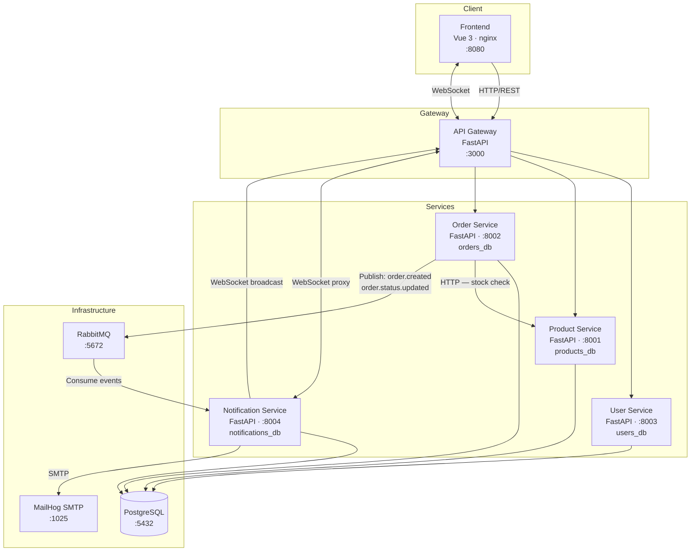
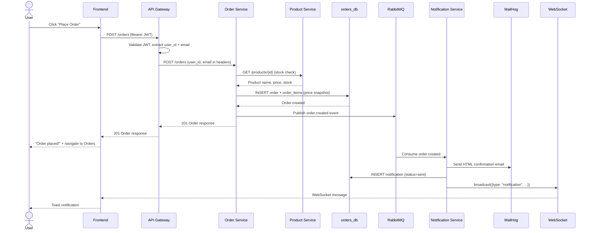
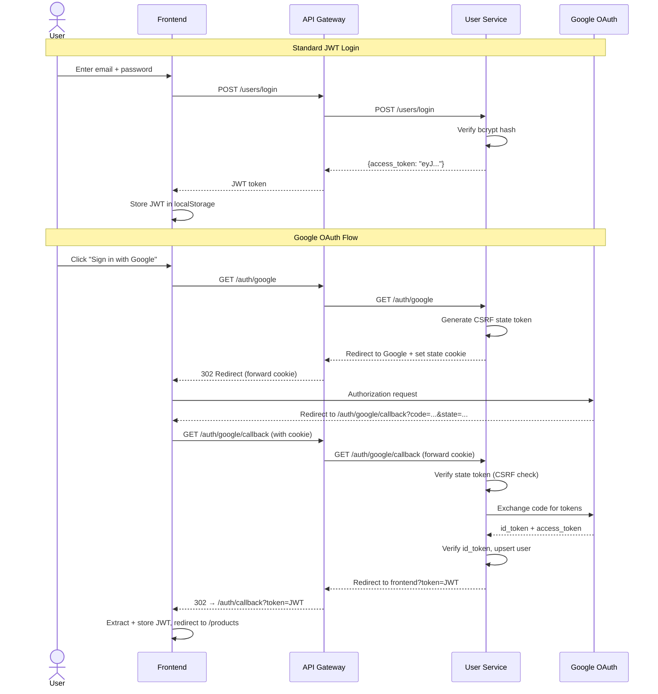

# Architecture Documentation

## System Overview

This platform is built as a collection of independently deployable microservices, each owning its own data store and communicating through well-defined interfaces. The system consists of four backend services (user, product, order, notification), an API gateway, and a Vue 3 frontend — all orchestrated with Docker Compose.

The API Gateway is the single entry point for all client traffic. It handles JWT validation, proxies requests to the appropriate backend service, and maintains a WebSocket tunnel to the notification service for real-time push delivery. Backend services communicate with each other either synchronously over HTTP (order → product for stock checks) or asynchronously via RabbitMQ (order publishes events, notification consumes them).

The notification pipeline is fully decoupled from order processing. When an order is created or updated, the order service publishes an event to RabbitMQ and returns immediately. The notification service independently consumes that event, sends an HTML email via SMTP, broadcasts a WebSocket message to connected clients, and records the result in its own database — with a retry API for failed deliveries.

---

## Architecture Diagram



---

## Service Communication Patterns

### Synchronous: HTTP/REST

**Who:** Order Service → Product Service

**Why:** Order creation requires a real-time stock/existence check before the order can be committed to the database. This is a blocking operation — the order cannot be created if the product does not exist or is out of stock. A synchronous call gives an immediate, consistent answer.

**Implementation:** `ProductClient` in `order-service/app/clients/product_client.py` uses `httpx` with a configurable timeout (default 5s). It maps HTTP errors to typed exceptions (`ProductNotFoundError`, `ProductServiceTimeoutError`, `ProductServiceUnavailableError`) so routes return correct HTTP status codes to the caller.

**Service discovery:** Docker network DNS — `http://product-service:8001` resolves via Docker's internal DNS.

---

### Asynchronous: RabbitMQ Events

**Who:** Order Service (publisher) → Notification Service (consumer)

**Why:** Sending emails and pushing WebSocket notifications do not need to block the order creation response. Decoupling these via a message queue means order latency is unaffected by email delivery delays, and the notification service can fail/restart independently without losing events (durable queue).

| Property | Value |
|----------|-------|
| SNS Topic | `order-events` |
| SQS Queue | `notification-queue` (subscribed to topic) |
| Event types | `order.created`, `order.status.updated` |
| Client library | `aioboto3` (async) |
| Dev environment | LocalStack (port 4566) |

**Event payload** includes: `order_id`, `user_id`, `user_email`, `status`, `items`, `total_amount`, `timestamp`.

---

### Real-time: WebSocket

**Flow:**
1. Frontend connects to `ws://localhost:8080/ws/notifications` (nginx proxy)
2. nginx forwards to API Gateway `ws://api-gateway:3000/ws/notifications`
3. Gateway maintains a bidirectional proxy to Notification Service `ws://notification-service:8004/ws`
4. When the notification service processes a SQS event, it calls `manager.broadcast()` to push to all connected WebSocket clients
5. Frontend receives the message and displays a toast notification

**Connection management:** `ConnectionManager` singleton in `notification-service/app/websocket/manager.py` — thread-safe, handles dead connection cleanup, ping/pong keepalive.

---

## Database Strategy

### Database-per-Service Pattern

Each service owns exactly one PostgreSQL database and no service queries another service's database directly.

| Service | Database |
|---------|----------|
| User Service | `users_db` |
| Product Service | `products_db` |
| Order Service | `orders_db` |
| Notification Service | `notifications_db` |

All four databases live on a single PostgreSQL instance (dev convenience), but the ownership boundary is strict — cross-database queries are never used.

### No Cross-Service Foreign Keys

Order items reference products by `product_id` (an integer), but there is no database-level foreign key constraint to `products_db`. This is intentional:

- Services can be deployed, scaled, and migrated independently
- Product records can be deleted without orphaning order history
- The order service does not need a live join to the product database at query time

### Data Snapshot Pattern

When an order is created, the order service copies the product's name and price into the `order_items` table at that moment:

```
OrderItem.product_id    → reference only (no FK)
OrderItem.product_name  → snapshot of name at order time
OrderItem.product_price → snapshot of price at order time
OrderItem.subtotal      → pre-calculated
```

This means historical orders always reflect the price the customer actually paid, regardless of future product price changes.

---

## Event-Driven Architecture

### Exchange & Queue

```
Exchange:  ecommerce_events  (type: TOPIC, durable: true)
Queue:     notification_queue (durable: true, prefetch: 10)
Binding:   order.*  →  notification_queue
```

### Events

**`order.created`** — published immediately after an order is persisted to the database.

**`order.status.updated`** — published when an order's status changes (confirmed, shipped, delivered, cancelled).

### Publisher (Order Service)

`order-service/app/events/publisher.py` publishes events to the SNS topic after each successful DB commit using `aioboto3`. On startup, `EventPublisher.initialize()` resolves the topic ARN via an idempotent `create_topic` call. If SNS is unavailable, the exception is caught and logged; the order creation itself is not rolled back (graceful degradation).

### Consumer (Notification Service)

`notification-service/app/events/consumer.py` runs `OrderEventConsumer` as a background asyncio task during lifespan. It:

1. Resolves the SQS queue URL via `get_queue_url` on startup
2. Long-polls the queue (`WaitTimeSeconds=20`, up to 10 messages per batch)
3. Parses the SNS envelope: `Body.Message` contains the actual JSON payload
4. Routes by `Subject` field (`order.created` / `order.status.updated`)
5. Sends email + broadcasts WebSocket message + saves `Notification` record
6. **Deletes the message only on success** — failures leave the message in the queue for SQS to redeliver

### Delete-on-Success Pattern

The consumer only deletes a message after the full handler completes without exception:
- Failures are automatically redelivered by SQS after the visibility timeout
- Persistent failures (bad email address, etc.) are retried via `POST /notifications/retry/{id}`
- This replaces the previous Always-ACK pattern used with RabbitMQ

---

## Request Flow Diagrams

### Order Creation Flow



### Authentication Flow



---

## Security Architecture

### JWT

- **Issued by:** User Service on login or Google OAuth callback
- **Claims:** `sub` (user_id as string), `email`, `exp`
- **Algorithm:** HS256 with `SECRET_KEY` from environment
- **Validated by:** API Gateway middleware (`api-gateway/app/middleware/auth.py`) before forwarding to protected routes
- **Forwarded as:** Gateway extracts `user_id` and `email` from validated token and passes them to backend services as request headers — backend services trust these headers and do not re-validate the JWT

Protected routes: `/users/me`, all `/orders/*` endpoints.

### Google OAuth 2.0 — CSRF Protection

The state parameter protects against CSRF attacks on the OAuth callback:

1. On `/auth/google`, user service generates a random state token with `secrets.token_urlsafe()`
2. State is stored in an `httponly` cookie on the response
3. Google redirects back with `?state=<token>` in the query string
4. User service compares cookie value vs query param using `secrets.compare_digest()` (timing-safe)
5. Mismatch → 400 error, flow aborted

The `httponly` flag prevents the cookie from being read by JavaScript, so an attacker cannot craft a callback URL that passes the state check.

### API Gateway as Security Boundary

The gateway is the only service exposed to external traffic. Backend services run on an internal Docker network and are not port-forwarded to the host in production configuration. This means:

- JWT validation happens once at the gateway, not in every service
- Backend services receive pre-validated identity headers
- Internal service-to-service calls (order → product) bypass the gateway entirely via Docker DNS

---

## Scalability Considerations

### Stateless Services

All four backend services are stateless — no in-memory session state. Authentication is validated from the JWT on each request. This means any number of service replicas can run behind a load balancer without sticky sessions.

### Message Queue for Async Workloads

Email delivery and WebSocket broadcasting are offloaded to the notification service via RabbitMQ. This means:

- Order service response time is not coupled to email delivery latency
- The notification service can be scaled independently based on event volume
- The durable queue buffers events during notification service restarts

### Database per Service

Each service scales its database independently. A read-heavy product catalog can add read replicas without affecting the order or user databases. Services can migrate to different database technologies (e.g., product service to a document store) without coordination.

---

## Known Limitations & Future Improvements

### Not Implemented (Current State)

- **Inventory decrement** — order creation validates stock but does not decrement it; concurrent orders can oversell
- **Rate limiting** — no request throttling at the gateway; APIs are open to abuse
- **Authentication on product/notification endpoints** — product writes and notification reads are unauthenticated
- **Distributed transactions** — no saga or 2PC pattern; a partial failure (order saved, RabbitMQ publish fails) is silently degraded
- **Token refresh** — JWTs expire and require re-login; no refresh token flow

### Production Additions

- **Redis** — session cache, rate limiting, product catalog caching
- **Distributed tracing** — OpenTelemetry + Jaeger for cross-service request tracing
- **Centralized logging** — ELK Stack (Elasticsearch, Logstash, Kibana)
- **Metrics & alerting** — Prometheus + Grafana dashboards
- **Kubernetes** — Helm charts, horizontal pod autoscaling, liveness/readiness probes
- **Service mesh** — Istio for mTLS between services, circuit breaking, traffic policies
- **Secrets management** — HashiCorp Vault or Kubernetes Secrets instead of `.env` files
- **CI/CD** — GitHub Actions pipeline (lint → test → build → deploy)
